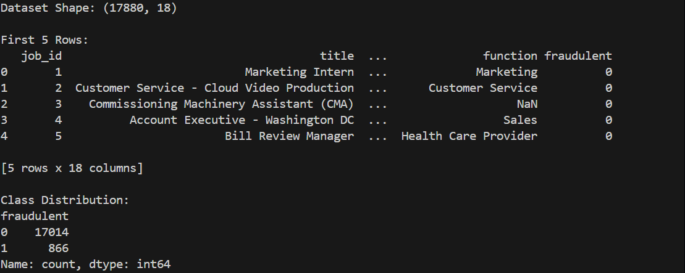
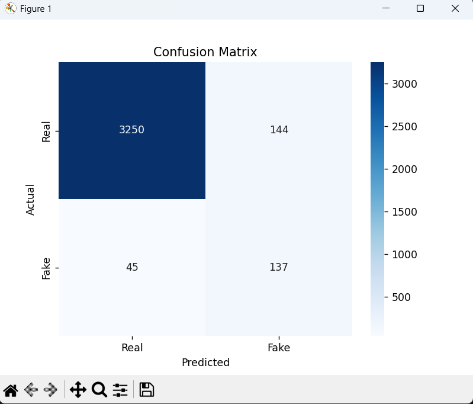
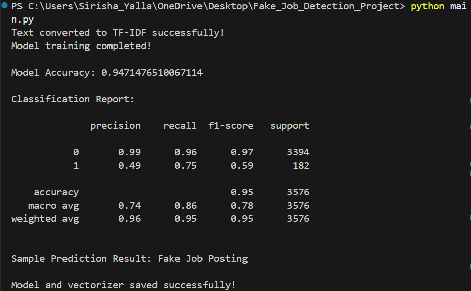

# AI-Based Fake Job Posting Detection System

## 📌 Project Overview
This project uses Machine Learning and Natural Language Processing (NLP) techniques to detect fraudulent job postings. 
It helps protect job seekers from online recruitment scams.

## 🚀 Problem Statement
Online job portals sometimes contain fake or fraudulent job postings. 
This project aims to build a classification model that can automatically detect fake job listings.

## 🛠 Technologies Used
- Python
- Pandas
- NumPy
- Scikit-learn
- TF-IDF Vectorizer
- Logistic Regression
- Matplotlib
- Seaborn

## 📊 Model Workflow
1. Data Cleaning
2. Text Preprocessing
3. Feature Extraction using TF-IDF
4. Train-Test Split
5. Logistic Regression Model Training
6. Model Evaluation using Accuracy, Classification Report & Confusion Matrix

## 📈 Model Performance
- Accuracy: ~94–96%
- Improved fraud detection using balanced classification
- Visualized results using confusion matrix

## 📊 Dataset
This project uses the *Real or Fake Job Posting Prediction* dataset from Kaggle.

🔗 Dataset Link:  
https://www.kaggle.com/datasets/shivamb/real-or-fake-fake-jobposting-prediction

The dataset contains job postings labeled as real or fake and is used to train and evaluate the classification model.

## ▶ How to Run the Project

1. Install dependencies:
   pip install -r requirements.txt

2. Run the program:
   python main.py

## 📷 Project Results

### 📌 Dataset Preview (First 5 Rows)

---

### 📌 Confusion Matrix

---

### 📌 Classification Report & Model Accuracy

---

## 🎯 Key Features
- Text preprocessing and cleaning
- TF-IDF feature extraction
- Machine Learning classification model
- Model evaluation using standard metrics
- Result visualization using confusion matrix

---

## 🌍 Social Impact
This system can help reduce online job fraud and protect job seekers from scams, making recruitment platforms safer.

---

## 👨‍💻 Author
Jagadeesh Yalla  
B.Tech – Computer Science Engineering  
Machine Learning & AI Enthusiast

Developed as part of Microsoft Elevate – Azure Internship (AICTE)
